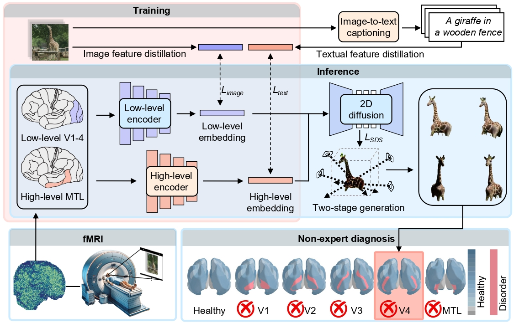
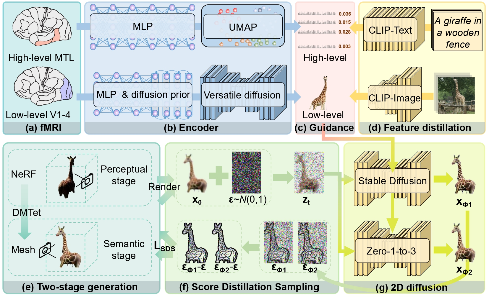
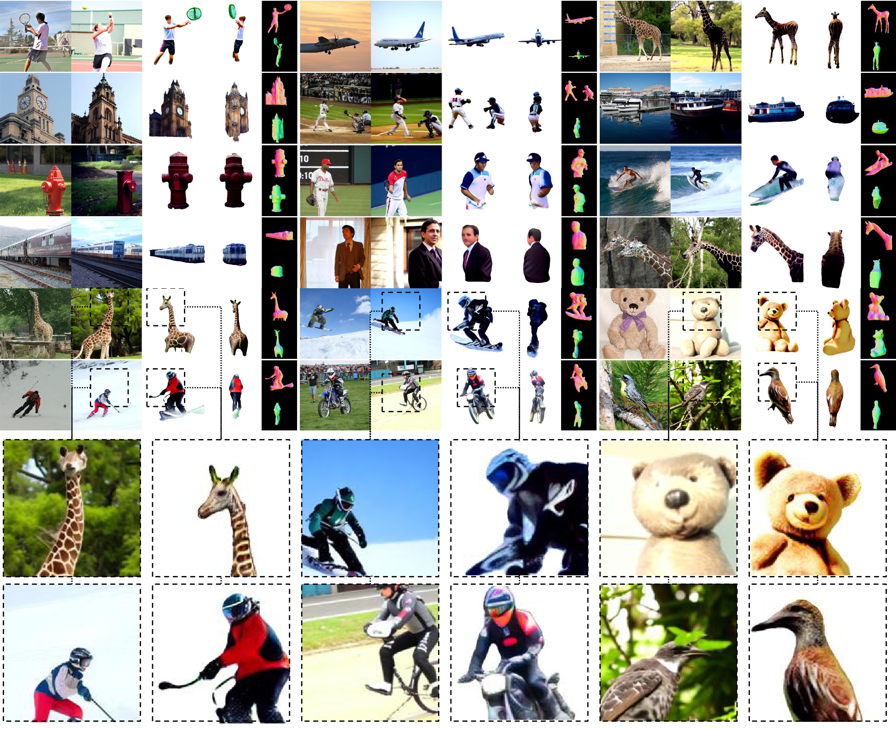
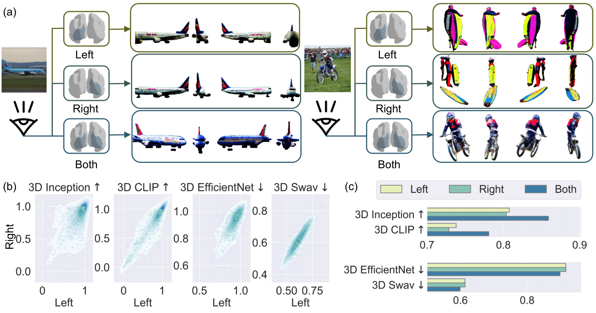
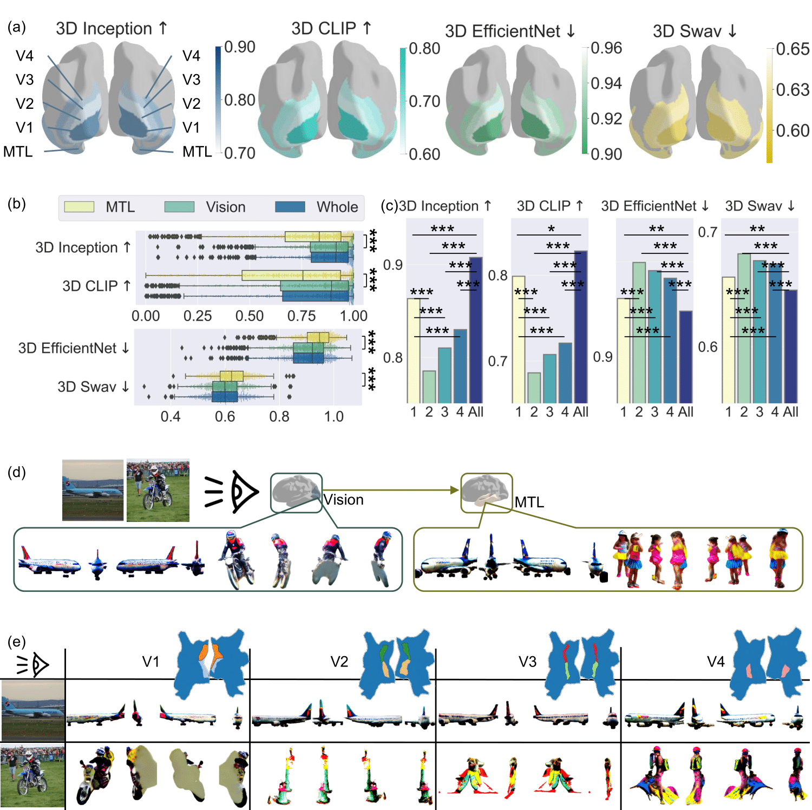
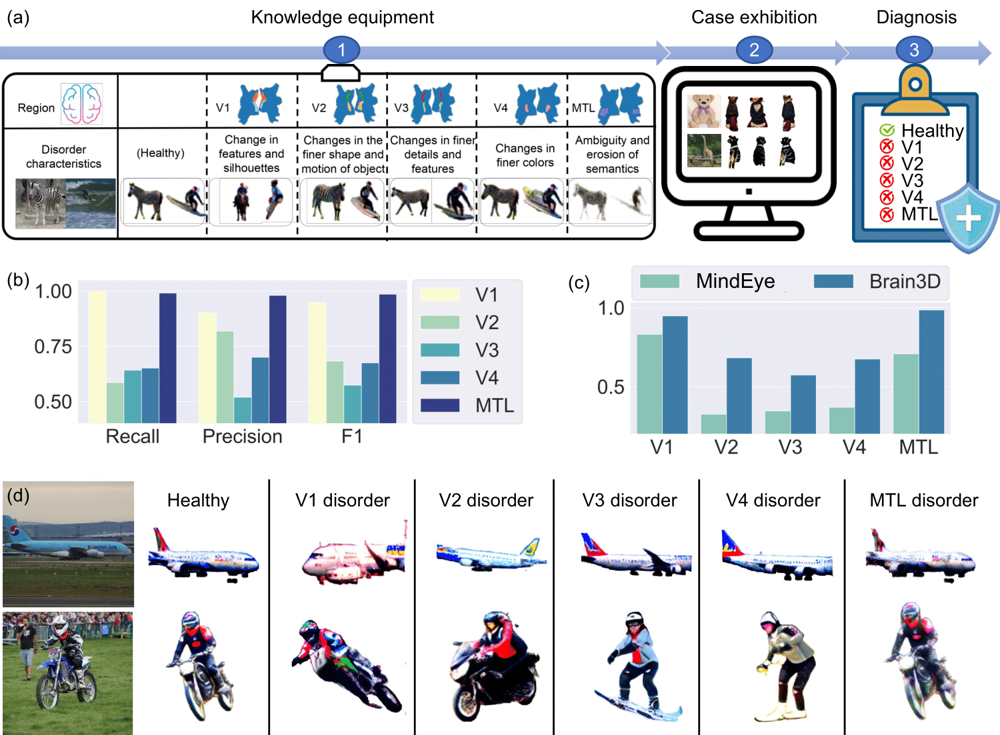
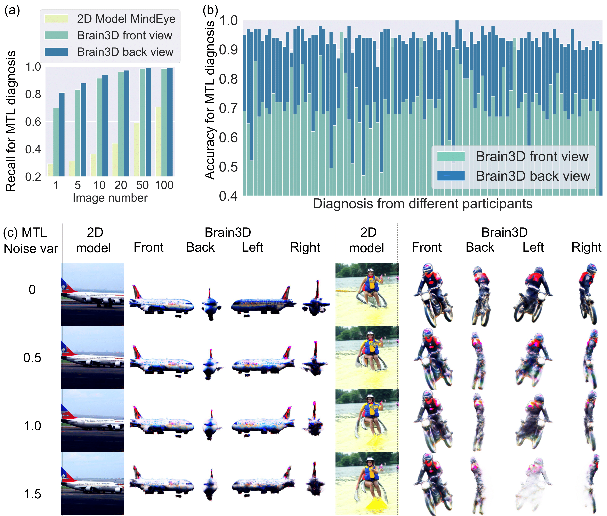
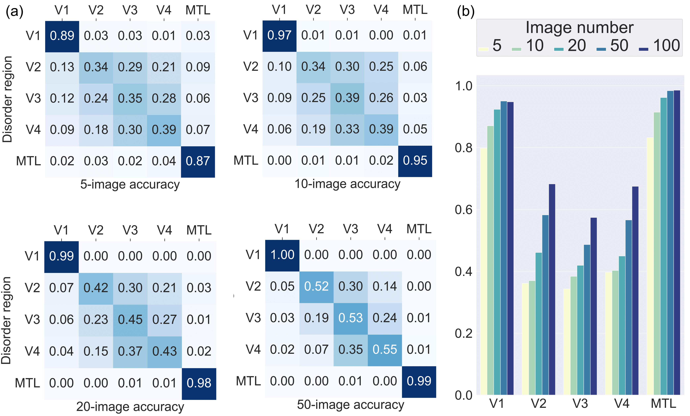

# Neural 3D decoding for human vision diagnosis
### [Project page](https://brain-3d.github.io/) | [Paper](https://arxiv.org/abs/2405.15239)
> [**Neural 3D decoding for human vision diagnosis**](https://arxiv.org/abs/2405.15239),            
> Li Zhang, Yuankun Yang, Ziyang Xie, Zhiyuan Yuan, Jianfeng Feng, Xiatian Zhu, Yu-Gang Jiang




**This repository is the official implementation of "Neural 3D decoding for human vision diagnosis".** Our code will come before publication. 


## 🛠️ Pipeline



## 🎥 Results
Brain3D extracts rich appearance, semantic and geometric information, presenting a high degree of consistency with the stimuli images.



## 🎥 Analysis
Enhanced quality through collaboration between left and right hemispheres

Dominance of V1 visual regions  in feature and silhouette processing

## 🎥 Diagnosis
Brain3D can diagnose regions with disorder



## Reference

```bibtex
@article{zhang2024neural,
  title={Neural 3D decoding for human vision diagnosis},
  author={Zhang, Li and Yang, Yuankun and Xie, Ziyang and Yuan, Zhiyuan and Feng, Jianfeng and Zhu, Xiatian and Jiang, Yu-Gang},
  journal={arXiv preprint arXiv:2405.15239},
  year={2024}
}
```